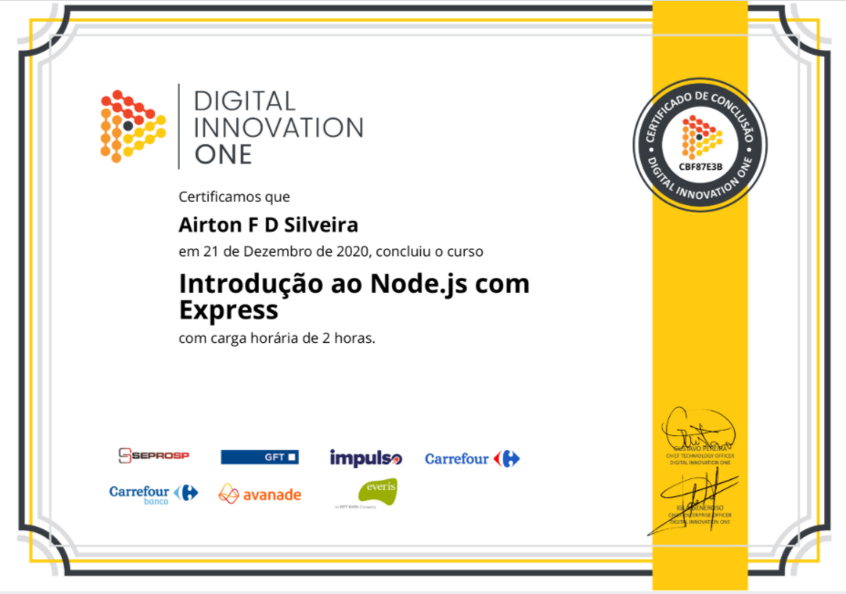

## PROJETO API - GET/POST/PUT/DELETE

Esse projeto foi desenvolvido no curso de Node js e Express da Digital Innovation One

## INTRODUÇÃO AO NODE JS COM EXPRESS - DIGITAL INNOVATION ONE

Rode os seguintes comandos.
 
* npm install express --save
* npm init
* node index.js

Obs: O projeto esta rodando na porta 8000